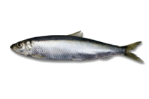

```{r setup, include=FALSE}
options(warn=-1)
knitr::opts_chunk$set(echo = TRUE)
```

[Biblioteki](#importowanie-bibliotek)  
[Wczytywanie danych](#wczytywanie-danych)  
[Wstępne przetwarzanie](#wstępne-przetwarzanie)  
[Rozmiar zbioru oraz podstawowe statystyki](#rozmiar-zbioru-oraz-podstawowe-statystyki)  
[Szczegółowa analiza atrybutów](#szczególowa-analiza-atrybutów)  
[Analiza szeregów czasowych](#analiza-szeregów-czasowych)  
[Badanie korelacji atrybutów](badanie-korelacji-atrybutów)  
[Animacja](animacja)  
[Podział zbioru na zbiory treningowy, walidacyjny oraz testowy](#podział-zbioru-na-zbiory-treningowy-validacyjny-oraz-testowy)  
[Pomiar metryk](#pomiar-metryk)  
[Skalowanie wartości atrybutów](skalowanie-wartosci-atrybuóow)  
[Regresja modelem liniowym](#regresja-modelem-liniowym)  

### Importowanie bibliotek

```{r}
library(jsonlite)
library(tidyverse)
library(dplyr)
library(ggplot2)
library(reshape2)
library(magick)
library(gapminder)
library(plotly)
library(corrplot)
library(caret)
```


### Wczytywanie danych

```{r}
data_path <- "data/"
data <- read_csv(paste(data_path, "sledzie.csv", sep=""), na = "?", col_types = cols(recr=col_integer(), totaln=col_integer(), xmonth = col_integer()))
```

Atrybut "totaln" wbrew oczekiwaniom jest wartością zmienno-przecinkową co wskazuje na to, że jest określony jako średnia liczba śledzi złowionych w ramach połowu.

```{r}
problems(data)
```

Poprawne wczytanie danych
```{r}
data_path <- "data/"
data <- read_csv(paste(data_path, "sledzie.csv", sep=""), na = "?", col_types = cols(recr=col_integer(), xmonth = col_integer()))
```

### Wstępne przetwarzanie

Zmiana nazwy pierwszej kolumny

```{r}
data <- data %>% rename(lp = X1)

data
```


Analiza wartości brakujących

```{r}
na.omit(data) %>%
  summarise(n())
```


Niestety pominięcie wierszy zawierających wartości brakujące powoduje obniżenie liczby rekordów w zbiorze danych z 52582 do 42488.
Sugeruje to potrzebę wypełnienia takich wartości pewnymi wartościami domyślnymi.

Dla każdej z kolumn poniżej zaprezentowano liczbę brakujących wartości.

```{r}
data %>%
  summarise_all(funs(sum(is.na(.))))
```

Jak zaobserwowano wartości brakujące występują w kolumnach "cfin1", "cfin2", "chel1", "chel2", "lcop1", "lcop2", "sst".

Dla wartości określających dostępność planktonu, jak i dla temperatury powierzchni wody zastąpiono brakujące wartości wartościami poprzedzającymi dla poszczególnych atrybutów, ze względu na znaczenie kolejności danych.

```{r}

data <- fill(data, "cfin1", "cfin2", "chel1", "chel2", "lcop1", "lcop2", "sst", .direction="downup")

data
```

### Rozmiar zbioru oraz podstawowe statystyki


```{r}
summary(data)
```

Rozmiar zbioru znajduje się w wyższej części raportu, można go również odczytać z podstawowych statystyk dla kolumny lp z pola "Max.". Powyżej zaprezentowane podstawowe statystyki dla każdego z atrybutów. Ich analiza wartości atrybutów zostanie dokonana w kolejnych częściach sprawozdania.

### Szczegółowa analiza atrybutów

Poniżej zamieszczono histogramy dla poszczególnych atrybutów. Dla zachowania czytelności wykresów rozdzielono
je na dwie sekcje.

```{r}
d <- melt(data %>% select(-c("lp", "xmonth", "recr", "fbar", "totaln", "sal")))
ggplot(data = d, aes(x = value)) +
  facet_wrap(~variable, scales = "free") +
  geom_histogram()
```


```{r}
d <- melt(data %>% select(c("xmonth", "fbar", "recr", "totaln", "sal")))
ggplot(data = d, aes(x = value)) +
  facet_wrap(~variable, scales = "free", ncol = 2) +
  geom_histogram()
```

Jak można zaobserwować na histogramie dla atrybutu "length" przypomina on rozkład normalny,
jest to efekt oczekiwany ze względu na podobieństwo długości ryb z tego samego gatunku.
Warto zwrócić uwagę na prawoskośność rozkładów dla atrybutów cfin1, cfin2, chel1, lcop1.
Pozostałe rozkłady są różnowartościowe, wielomodalne, o dużej entropii.
Histogram dla atrybutu xmonth wskazuje na to, że większość pomiarów została dokonana w okresie letnim.

### Analiza szeregów czasowych

Analiza obejmuje badanie autokorelacji atrybutu length, aby potwierdzić lub wykluczyć jego okresowość. W celu utworzenia wykresów została wykorzystana funkcja z
https://rh8liuqy.github.io/ACF_PACF_by_ggplot2.html

```{r, code = readLines("correlogram.R")}
ggplot.corr(data %>% select("length"), large.sample.size = TRUE, horizontal = TRUE)
```


```{r}

```


### Badanie korelacji atrybutów


```{r}

cor_mat <- data[, 1:ncol(data)]
cor_mat = cor(cor_mat)
corrplot(cor_mat)

```

Macierz korelacji pokazuje, silną zależność liniową następujących par atrybutów

* chel1, lcop1
* chel2, lcop2
* cumf, fbar
* cumf, totaln

Może to być przesłanka do usunięcia niektórych atrybutów ze zbioru w celu poprawienia predykcji.


Dodatkowo w poniższej części zaprezentowano wykresy zależności długości ryby od wartości poszczególnych atrybutów.
Niestety nie zaobserowano żadnej oczywistej zależności.

```{r}

sampled_data <- data[sample(nrow(data), 1000),]
length_base <- sampled_data %>% pull(var = "length")

for (attr in list(c("cfin1", "cfin2", "chel1", "chel2"),
                  c("lcop1", "lcop2", "fbar",  "recr"),
                  c("cumf", "totaln", "sst", "sal"),
                  c("xmonth", "nao"))) {
  d <- melt(sampled_data %>% select(attr))
  
  length <- rep_len(length_base, length.out = nrow(d))
  d %>% add_column(length)
  
  print(
    ggplot(data = d, aes(x = value, y = length)) +
      facet_wrap(~variable, scales = "free", ncol = 2) +
      geom_point() + 
      geom_smooth()
  )
}

```


### Animacja

```{r}
sizes <- toJSON(sampled_data$length)
n  <- 1000
```

<input type="range" min="1" max=`r n` value=cur class="slider" id="myRange">

<input id="current_idx" type="text" value="">

<script>
var slider = document.getElementById("myRange");
sizes = (`r sizes`)

slider.oninput = function() {
  cur = slider.value; 
  var s = document.getElementById('current_idx');
  
  size = sizes[cur-1]
  
  s.value = 'Indeks: ' + cur + '\t Rozmiar: ' + size;
  
  var ryba = document.getElementById('ryba');
  ryba.width = size*10
}
</script>


### Podział zbioru na zbiory treningowy, validacyjny oraz testowy

```{r}
idx <- createDataPartition(data$length, p=0.8, list=F)

data_nolp <- data %>% select(-c("lp"))

train_ds <- data_nolp[idx, ]
test_ds <- data_nolp[-idx, ]

idx <- createDataPartition(train_ds$length, p=0.8, list=F)

valid_ds <- train_ds[-idx, ]
train_ds <- train_ds[idx, ]
```


### Pomiar metryk

```{r}
# Compute R^2 from true and predicted values
eval_results <- function(true, predicted, df) {
  SSE <- sum((predicted - true)^2)
  SST <- sum((true - mean(true))^2)
  R_square <- 1 - SSE / SST
  RMSE = sqrt(SSE/nrow(df))

  
  # Model performance metrics
data.frame(
  RMSE = RMSE,
  Rsquare = R_square
)
  
}

```


### Skalowanie wartości atrybutów

Jest ono potrzebne dla poprawnego działania zastosowanego rozwinięcia modelu liniowego.

```{r}
col_names <- colnames(train_ds)
to_be_preprocessed <- col_names[!(col_names %in% c("length"))] # 

pre_proc_val  <- preProcess(train_ds[, to_be_preprocessed], method = c("center", "scale"))
train_ds[, to_be_preprocessed] = predict(pre_proc_val, train_ds[, to_be_preprocessed])
valid_ds[, to_be_preprocessed] = predict(pre_proc_val, valid_ds[, to_be_preprocessed])
test_ds[, to_be_preprocessed] = predict(pre_proc_val, test_ds[, to_be_preprocessed])

summary(train_ds)
```


### Regresja modelem liniowym

```{r}
linear_model <- lm(length ~ ., data = train_ds)
print(linear_model)
```


```{r}
summary(linear_model)
```

```{r}
# Train
predictions_train <- predict(linear_model, train_ds)
eval_results(train_ds$length, predictions_train, train_ds) 

# Valid
predictions_valid <- predict(linear_model, valid_ds)
eval_results(valid_ds$length, predictions_valid, valid_ds) 
```

Dla regresji liniowej uzyskany model uzyskuje wartość miary RMSE na poziomie 1.331.
Średnio myli się o 1.331 cm na zbiorze treningowym.
Niestety bardzo niska wartość miary R^2 na poziomie 0.3536, oznacza wysoką wariancję uzyskanych predykcji, prawdopodobnie jest to efektem niskiej złożoności modelu.

Domyślnie wraz z uczeniem wykonywane są testy statystyczne dotyczące poziomu istotności poszczególnych atrybutów. Jak można zaobserwować atrybutami mało wpływającymi na predykcjię są chel1 oraz chel2.


```{r}
linear_model_v2 <- glm(length ~ . +sst * nao + nao * chel2 +fbar * cumf -xmonth -cfin2 -sal -totaln, data = train_ds)

summary(linear_model_v2)

# Train
predictions_train <- predict(linear_model_v2, train_ds)
eval_results(train_ds$length, predictions_train, train_ds) 

# Valid
predictions_valid <- predict(linear_model_v2, valid_ds)
eval_results(valid_ds$length, predictions_valid, valid_ds) 
```
